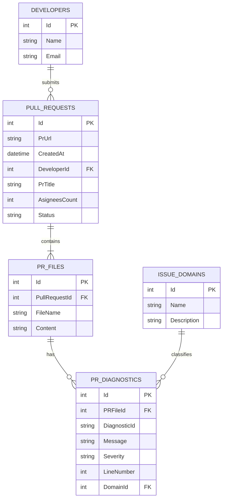

# Backend API & Database Schema Documentation

This document provides a comprehensive technical reference for the **Automated PR Reviewer Backend API**, built on **ASP.NET Core 8**, **Entity Framework Core**, and **SQLite**.

---

## 1. System Architecture Overview

The backend is structured into three main layers:
1. **Controllers**: Exposes HTTP endpoints for frontend consumption and GitHub webhook integrations.
2. **Services**:
   - `GitHubService`: Communicates with the GitHub API (via Octokit) to fetch PR metadata, author details, and file contents.
   - `AnalyzerService`: Performs static code analysis using **Microsoft.CodeAnalysis.CSharp (Roslyn)** for C# files and **Custom Regex Parsers** for JS/TS/CSS files.
   - `DeveloperStatsService`: Aggregates developer scores, issue history, strengths, and weaknesses across pull requests.
   - `DashboardService`: Aggregates repository-wide metrics, weekly trends, and recent analysis runs.
3. **Database Context (EF Core)**: Manages SQLite data mapping and storage.

---

## 2. API Reference

### POST `/api/pr/analyze`
Submits a GitHub pull request URL for analysis. It fetches files from GitHub, runs analysis, records everything in the database, and returns the analysis results.

- **Request Headers**: `Content-Type: application/json`
- **Request Body**:
  ```json
  {
    "prUrl": "https://github.com/Owner/Repo/pull/1"
  }
  ```

- **Response Type**: `PRAnalysisResponseDto`
- **Response Status Codes**:
  - `200 OK`: Analysis completed successfully.
  - `500 Internal Server Error`: Connection failed or repository not found.

---

### GET `/api/pr/{prId}`
Retrieves a past pull request analysis by its database ID.

- **URL Parameter**: `prId` (integer)
- **Response Type**: `PRAnalysisResponseDto`

---

### GET `/api/DeveloperStats/all`
Calculates and returns aggregated metrics for all developers who have analyzed PRs.

- **Response Type**: `List<DeveloperStatsDto>`
  ```json
  [
    {
      "developer": {
        "name": "Nikku-Nikhil",
        "avatar": "",
        "githubUrl": ""
      },
      "totalPRsReviewed": 2,
      "commonIssues": [
        {
          "type": "Code Quality",
          "count": 8,
          "percentage": 100,
          "trend": "stable",
          "examples": [
            "Magic number detected — consider extracting to a named constant."
          ]
        }
      ],
      "improvementAreas": ["Code Quality"],
      "strengths": ["Security", "Style"],
      "lastAnalyzed": "2026-06-21",
      "overallScore": 84,
      "scoreHistory": [
        { "date": "2026-06-21", "score": 92 }
      ]
    }
  ]
  ```

---

### Dashboard Endpoints (`/api/Dashboard/...`)

1. **GET `/api/Dashboard/team-stats`**
   - Returns repository-wide totals (Total PRs, average review scores, total issues found).
2. **GET `/api/Dashboard/weekly-trends`**
   - Returns a 7-day trend history of PR counts and scores.
3. **GET `/api/Dashboard/recent-analyses`**
   - Returns the latest 5 PR analyses run on the platform.
4. **GET `/api/Dashboard/issue-domain-scores`**
   - Returns counts of issues grouped by category domain (`Code Quality`, `Security`, `Style`, `SQL`).

---

## 3. Analysis Scenarios: C# vs. React PRs

The backend handles **C# PRs** and **React (JS/TS) PRs** differently due to their language architectures.

### Scenario A: Giving a C# PR (`.cs` files)
When a C# file is submitted:
1. **Compilation**: The backend parses C# syntax trees using **Roslyn CSharpSyntaxTree**.
2. **Semantic Check**: It compiles C# files dynamically to retrieve formal Roslyn compiler diagnostics (e.g. `CS0103` missing references, `CS0219` unused variables, and StyleCop warnings).
3. **Category Mapping**:
   - Roslyn warnings starting with `CS` or `IDE` are categorized as **Code Quality**.
   - StyleCop warnings starting with `SA` are categorized as **Style**.
   - Roslyn code analyzer warnings starting with `CA` or `SEC` are categorized as **Security**.

#### Sample Response for C# PR:
```json
{
  "prUrl": "https://github.com/Nikku-Nikhil/EMS-Backend/pull/5",
  "title": "Implement User Authentication Service",
  "author": "Nikku-Nikhil",
  "status": "Completed",
  "overallScore": 96,
  "metrics": [
    {
      "type": "Code Quality",
      "percentage": 50.0
    },
    {
      "type": "Style",
      "percentage": 50.0
    }
  ],
  "issues": [
    {
      "id": "1",
      "type": "warning",
      "category": "code quality",
      "file": "Services/AuthService.cs",
      "line": 42,
      "message": "CS0219: The variable 'tempToken' is declared but never used."
    },
    {
      "id": "2",
      "type": "info",
      "category": "style",
      "file": "Services/AuthService.cs",
      "line": 15,
      "message": "SA1513: Closing brace should be followed by blank line."
    }
  ],
  "commentsPosted": 2,
  "filesAnalyzed": 1
}
```

---

### Scenario B: Giving a React/JS PR (`.jsx`/`.tsx`/`.js`/`.ts` files)
Since JavaScript and JSX are interpreted, they are analyzed using **Universal Regex Pattern Matchers**:
1. **console.log Detection** (`GEN001` - Code Quality)
2. **TODO/FIXME Comments** (`GEN002` - Code Quality)
3. **Line Length Check** (`GEN003` - Style) (exceeding 120 characters)
4. **Hardcoded Secrets/API Keys** (`SEC001` - Security)
5. **debugger Statements** (`GEN004` - Code Quality)
6. **alert() Calls** (`GEN005` - Style)
7. **Magic Numbers** (`GEN006` - Code Quality) (raw numbers > 2 digits not inside constants)
8. **File Line Count Limit** (`GEN007` - Style) (files exceeding 400 lines)
9. **Async Functions without try/catch** (`GEN008` - Code Quality)

#### Sample Response for React PR:
```json
{
  "prUrl": "https://github.com/Nikku-Nikhil/EMS-Frontend/pull/1",
  "title": "export styles",
  "author": "Nikku-Nikhil",
  "status": "Completed",
  "overallScore": 92,
  "metrics": [
    {
      "type": "Code Quality",
      "percentage": 100.0
    }
  ],
  "issues": [
    {
      "id": "1",
      "type": "info",
      "category": "code quality",
      "file": "src/components/Content.jsx",
      "line": 46,
      "message": "Magic number detected — consider extracting to a named constant."
    },
    {
      "id": "2",
      "type": "warning",
      "category": "code quality",
      "file": "src/components/Content.jsx",
      "line": 12,
      "message": "Async functions found without any try/catch or .catch() error handling."
    }
  ],
  "commentsPosted": 2,
  "filesAnalyzed": 2
}
```

---

## 4. SQLite Database Schema

The database consists of 5 main tables: `Developers`, `PullRequests`, `PRFiles`, `PRDiagnostics`, and `IssueDomains`.

### ER Diagram (Entity-Relationship)



---

### Detailed Table Schemas

#### Table: `Developers`
Stores records of pull request authors.
| Column | Type | Nullable | Description |
| :--- | :--- | :--- | :--- |
| `Id` | `INTEGER` | No | Primary Key (Auto-Increment) |
| `Name` | `TEXT` | No | GitHub Login name (e.g. `Nikku-Nikhil`) |
| `Email` | `TEXT` | Yes | Developer email retrieved from GitHub |

#### Table: `PullRequests`
Stores pull request metadata.
| Column | Type | Nullable | FK / References | Description |
| :--- | :--- | :--- | :--- | :--- |
| `Id` | `INTEGER` | No | Primary Key | Auto-Increment ID |
| `PrUrl` | `TEXT` | No | - | Full GitHub URL of the PR |
| `CreatedAt` | `TEXT` | Yes | - | Timestamp of analysis run |
| `DeveloperId`| `INTEGER` | Yes | `Developers(Id)` | Reference to developer |
| `PrTitle` | `TEXT` | Yes | - | GitHub Pull Request Title |
| `AsigneesCount`| `INTEGER`| Yes | - | Number of assignees on PR |
| `Status` | `TEXT` | No | - | Review State (`Processing`/`Completed`) |

#### Table: `PRFiles`
Stores files changed in the pull request.
| Column | Type | Nullable | FK / References | Description |
| :--- | :--- | :--- | :--- | :--- |
| `Id` | `INTEGER` | No | Primary Key | Auto-Increment ID |
| `PullRequestId`| `INTEGER`| No | `PullRequests(Id)`| Reference to PR |
| `FileName` | `TEXT` | No | - | Relative path to file (e.g. `src/App.tsx`) |
| `Content` | `TEXT` | No | - | Contents of file at the PR state |

#### Table: `PRDiagnostics`
Stores diagnostic issues flagged by the static analyzer.
| Column | Type | Nullable | FK / References | Description |
| :--- | :--- | :--- | :--- | :--- |
| `Id` | `INTEGER` | No | Primary Key | Auto-Increment ID |
| `PRFileId` | `INTEGER` | No | `PRFiles(Id)` | Reference to file |
| `DiagnosticId`| `TEXT` | No | - | Rule ID (e.g. `GEN006`, `CS0219`) |
| `Message` | `TEXT` | No | - | Diagnostic message / suggestion |
| `Severity` | `TEXT` | No | - | Severity level (`Error`, `Warning`, `Info`) |
| `LineNumber` | `INTEGER` | Yes | - | Line number of issue (0 if global/none) |
| `DomainId` | `INTEGER` | No | `IssueDomains(Id)` | Reference to domain category |

#### Table: `IssueDomains`
Stores issue categories mapped dynamically.
| Column | Type | Nullable | Description |
| :--- | :--- | :--- | :--- |
| `Id` | `INTEGER` | No | Primary Key (Auto-Increment) |
| `Name` | `TEXT` | No | Category name (`Code Quality`, `Security`, `Style`, `SQL`) |
| `Description`| `TEXT` | Yes | Category description |

---

## 5. Calculations Formulas

### 1. Overall Score
The overall score for a single pull request is calculated on a deduction scale of **-2% per diagnostic warning/error**:
$$\text{Overall Score} = \max(0, 100 - (\text{Issue Count} \times 2))$$

*Example*: If a PR has 8 issues, the score is $\max(0, 100 - (8 \times 2)) = 84\%$.

### 2. Metrics Chart Percentages
Metrics percentages on the page represent the distribution of issues across the domains:
$$\text{Metric Percentage (Domain)} = \text{Round}\left(\frac{\text{Domain Diagnostics Count}}{\text{Total Diagnostics Count}} \times 100,\, 2\right)$$

### 3. Strength vs. Improvement Area Logic
- **Applicability Filter**: A domain is only relevant to a developer if their PR files contain compatible extensions (e.g., `SQL` is only applicable if `.sql` files are found).
- **Improvement Areas**: Top 3 applicable domains with issue count $> 0$, sorted by issue count descending.
- **Strengths**: Top 3 applicable domains where issue count is lowest, excluding any domains in the Improvement list.
